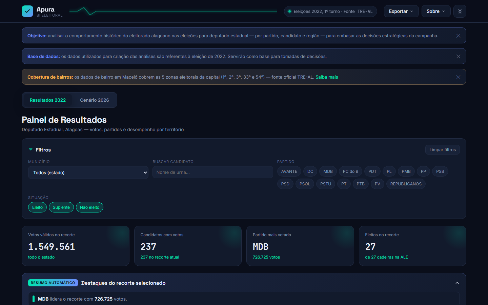

# Apura, painel de BI eleitoral

Painel para analisar o comportamento do eleitorado alagoano nas eleições para deputado estadual: votos por partido, candidato e território, com cobertura de bairros de Maceió. Abre no navegador, sem servidor e sem banco de dados.

**[Ver no ar](https://websitecampanha.vercel.app)** · **[Código-fonte completo](https://github.com/TjacksonAL/Website_Campanha)**

## O que faz

O painel tem duas visões, alternadas por botões no topo:

- **Resultados 2022**: a apuração real da eleição de 2022 para deputado estadual em Alagoas, com filtros por município, partido, candidato e situação (eleito, suplente, não eleito), indicadores, resumo automático dos destaques do recorte e exportação.
- **Cenário 2026**: a disputa de 2026 antes da urna, feita de eleitorado, concorrência e dinheiro declarado ao TSE. Qualquer número de votação nessa visão é de 2022, usado como base de comparação e rotulado como tal.

Há também tema claro e escuro e tabelas com cabeçalho congelado e ordenação por coluna.

## Como foi feito

- **Arquivo único.** Todo o HTML, CSS, JavaScript e os dados vivem dentro de um só arquivo. A única dependência externa é a biblioteca de gráficos Chart.js, carregada por CDN.
- **Dados reproduzíveis.** Os dados públicos são tratados por scripts em Python e PowerShell (`scripts/`), que geram as bases e as embutem no HTML. Um [RUNBOOK](https://github.com/TjacksonAL/Website_Campanha/blob/main/RUNBOOK.md) escrito para quem chega sem nenhum contexto explica como atualizar tudo.
- **Bairros de Maceió por local de votação.** O TSE publica votos por seção, não por bairro. O painel cruza a votação por seção com o relatório oficial do TRE-AL (seção, local de votação e endereço) para chegar ao bairro, cobrindo as cinco zonas eleitorais da capital.
- **Publicação.** Hospedado na Vercel, com regras de roteamento em `vercel.json`.

## Fontes de dados

Todas públicas:

- Portal de Dados Abertos do TSE: cadastro de candidatos, votação por candidato e município/zona, votação por seção e prestação de contas.
- Relatório oficial do TRE-AL de locais de votação por seção.

O escopo é apenas Deputado Estadual em Alagoas.

## Stack

HTML, CSS, JavaScript, Chart.js, Python e PowerShell, Vercel.
