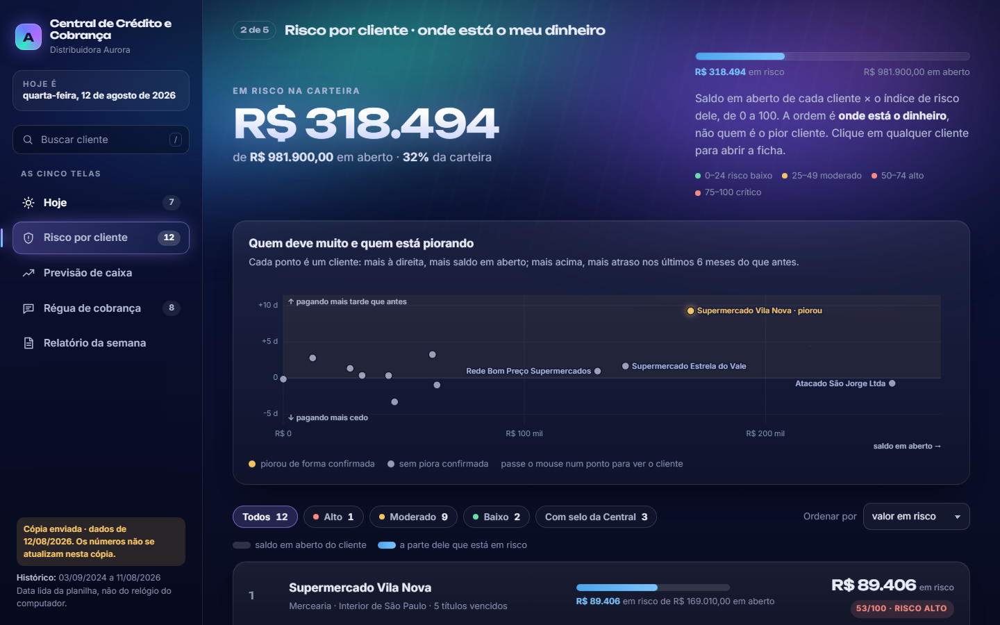
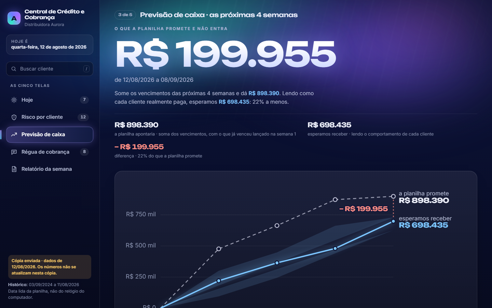

# Central de Crédito e Cobrança

Uma página HTML gerada por Python a partir de uma planilha de contas a receber. Responde, em cinco telas, às perguntas que um dono de distribuidora faz todo dia: **quem eu ligo primeiro, onde está meu dinheiro, quanto entra nas próximas semanas, o que eu digo ao cliente e o que eu levo para a diretoria.**

**[Ver no ar](https://central-credito-cobranca.vercel.app)** (arquivo único, dados fictícios de 12/08/2026)


## As cinco telas

| Tela | Pergunta que responde |
|---|---|
| **Hoje** | Quem eu ligo primeiro? Fila dos clientes com título vencido, com a frase que explica cada posição, o contato e os títulos um a um. |
| **Risco por cliente** | Onde está o meu dinheiro? Índice de risco de 0 a 100 por cliente, ordenado por valor em risco. |
| **Previsão de caixa** | Quanto entra nas próximas 4 semanas, lendo o comportamento de cada cliente, contra o que a soma dos vencimentos promete? |
| **Régua de cobrança** | O texto de cobrança pronto, no tom certo, para WhatsApp, e-mail e ligação, com registro de quem foi cobrado. |
| **Relatório da semana** | Texto corrido para a diretoria, para copiar ou imprimir em PDF. |





## Decisões de projeto

O que mais importa neste projeto não é a tela, e sim as regras que impedem que ela minta. Elas estão escritas no [CLAUDE.md](CLAUDE.md), com o porquê de cada uma.

- **Um comando, numa máquina limpa.** Só a biblioteca padrão do Python: sem `pip install`, sem internet, sem chave de API. A planilha `.xlsx` é lida com `zipfile` e `xml.etree`, e os gráficos são SVG montado à mão.
- **"Hoje" é a data da planilha, nunca o relógio do computador.** Assim os números não mudam sozinhos amanhã.
- **Dinheiro em centavos, como inteiro.** Nunca se soma valor em `float`. O arredondamento acontece na conta, título a título, para que a soma das semanas continue batendo com o total.
- **Nenhum número escrito à mão.** Tudo o que aparece na tela sai de conta sobre a planilha.
- **Uma conta, um lugar.** O comportamento de cada cliente é calculado em uma única função, e todas as telas leem dali. Isso existe porque duas telas já chegaram a mostrar o atraso do mesmo cliente com números diferentes.
- **Sem inteligência artificial e sem rede.** Todo texto de cobrança é montado a partir dos números já calculados, isolado em `redacao.py`. A Central redige e copia; quem envia é a pessoa.
- **Estimativa não tem centavo, valor fechado tem.**

## Como garantir que os números estão certos

Há duas verificações independentes:

- **`conferir.py`**, um teste de regressão. Compara os números com um retrato gravado, confere a estrutura das páginas e verifica cada item de [o_que_nao_pode_sumir.md](o_que_nao_pode_sumir.md), a lista, tela por tela, do que nenhuma mudança de aparência pode apagar. Se Node estiver instalado, também roda `teste_fila.js`, que testa com um DOM simulado a reordenação da fila.
- **`auditoria/reconferir.py`**, uma reconferência independente. Recalcula os totais direto da planilha, por outro caminho e com outra biblioteca de leitura, e compara com o que está escrito na tela.

## Como rodar

Precisa de Python 3 (testado com 3.12). No Windows, dê dois cliques em `Abrir Central.bat` ou, no terminal:

```bash
python central.py      # ou: py central.py
```

Isso lê `Base_bruta.xlsx`, gera `central.html` e `para_enviar/Central Aurora.html` (a mesma Central num arquivo só, para mandar a alguém) e abre no navegador.

Para rodar os testes:

```bash
python conferir.py                          # regressão: usa só a biblioteca padrão
pip install openpyxl && python auditoria/reconferir.py   # reconferência independente
```

## O que tem na pasta

| Arquivo | Para que serve |
|---|---|
| `central.py` | Lê a planilha, calcula e monta a página. |
| `redacao.py` | O único lugar que escreve texto para o cliente. |
| `conferir.py`, `conferencia_base.json`, `teste_fila.js` | Teste de regressão e o retrato dos números. |
| `auditoria/reconferir.py` | Reconferência independente. |
| `Base_bruta.xlsx` | Carteira de contas a receber. **Dados fictícios**, criados para fins didáticos. |
| `fontes/` | Unbounded, Inter e Space Grotesk, com as licenças OFL. Vão embutidas no HTML. |
| `demo.html` | A cópia para enviar, para ver a Central sem rodar nada. |
| `CLAUDE.md` | Documento de passagem de contexto para quem chega sem ter acompanhado a construção, pessoa ou Claude. |

O `CLAUDE.md` cita uma pasta `versoes/` com o histórico congelado das versões V1 a V9. Ela não está neste repositório.

## Stack

Python 3 (biblioteca padrão), HTML, CSS e JavaScript puros, SVG gerado por código. Sem frameworks, sem CDN, sem dependências em tempo de execução.
