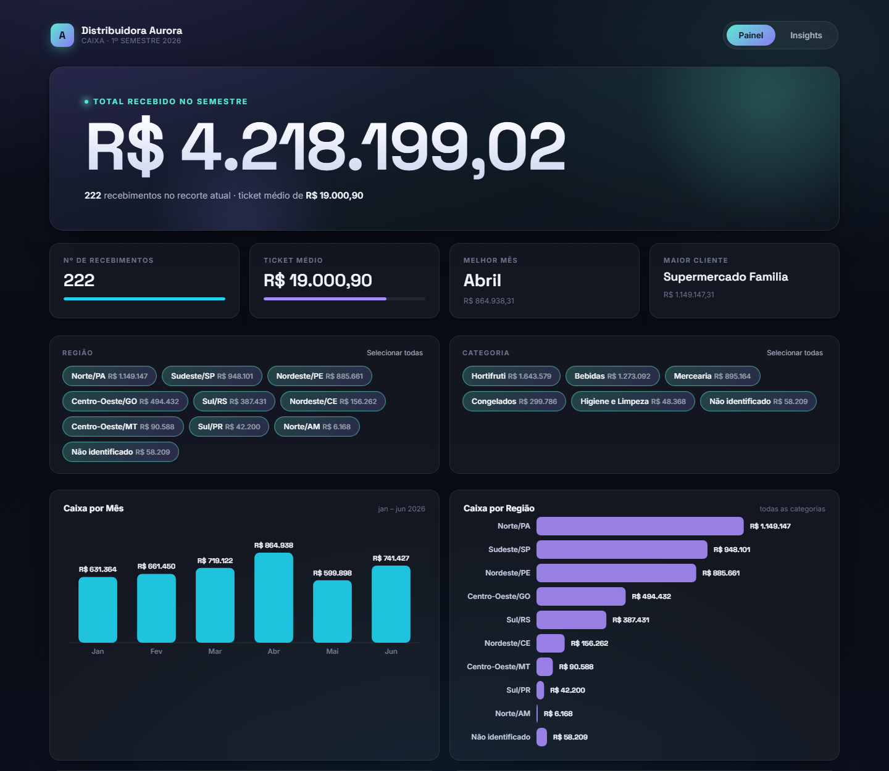

# Painel financeiro Aurora

Painel de caixa do primeiro semestre de 2026 de uma distribuidora de alimentos e bebidas, a partir da planilha de controle de recebimentos: quanto entrou, de quem, de onde e em que mês.

**[Abrir o painel](https://tjacksonal.github.io/portfolio-projetos/projetos/painel-financeiro-aurora/painel.html)**

## O que faz

- **Indicadores no topo:** total recebido no semestre, número de recebimentos, ticket médio, melhor mês e maior cliente.
- **Filtros por região e por categoria de produto**, com o valor de cada opção ao lado. Os indicadores e os gráficos do painel se recalculam ao filtrar.
- **Gráficos** de caixa por mês e de caixa por região, desenhados em SVG.
- **Aba Insights**, com a leitura do semestre em texto. Ela explica, por exemplo, que a queda de maio parece alarmante mas vem quase toda de um único cliente que pagou muito em abril, e mostra quais regiões ganharam ou perderam força de um trimestre para o outro. Traz só números absolutos, sem estimativa nem projeção.

## Dados

A empresa, os clientes e os valores são **fictícios**, criados para fins didáticos.

## Stack

HTML, CSS e JavaScript puros, num arquivo só e sem bibliotecas de gráficos. Só as fontes vêm do Google Fonts.
