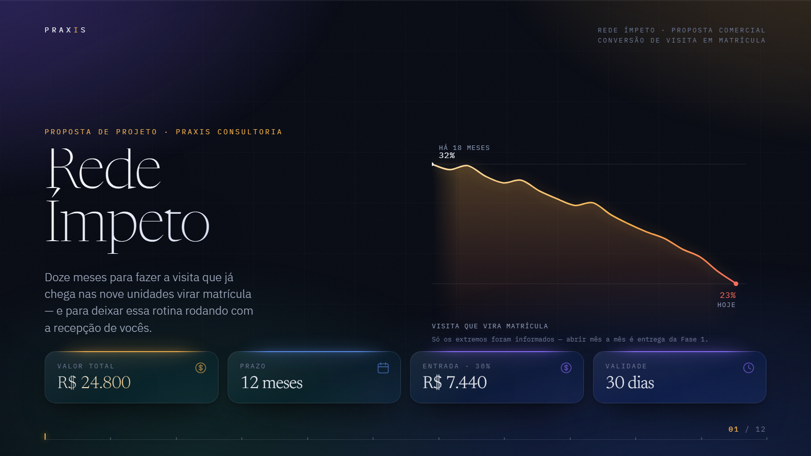
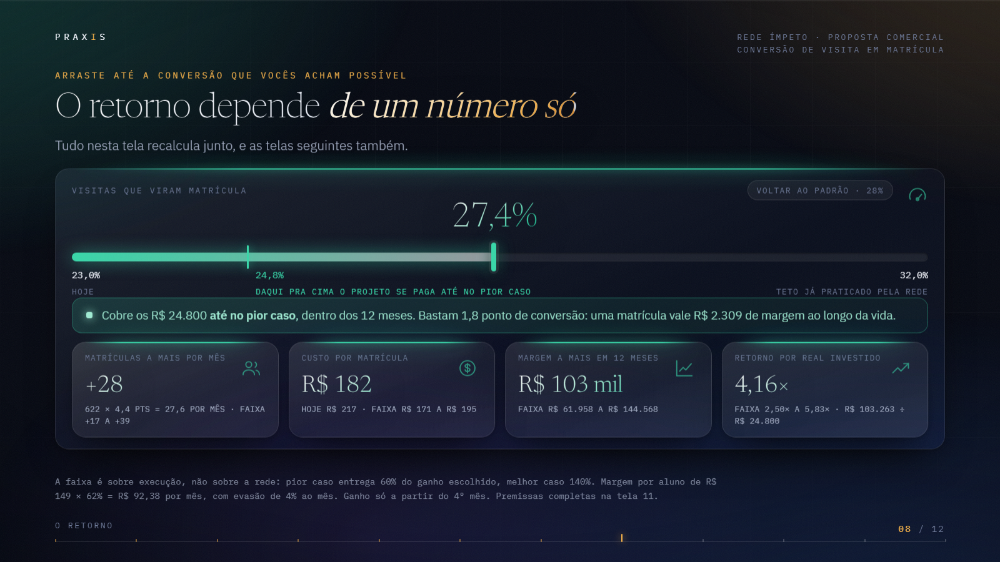

# Proposta Comercial

Uma proposta de consultoria feita como apresentação de tela cheia, num único arquivo HTML, para ser aberta numa reunião e passada com as setas do teclado. A ideia central é que o cliente **arraste um controle e veja o retorno do projeto ser recalculado**, nessa tela e nas seguintes.

**[Ver no ar](https://proposta-comercial-impeto.vercel.app)** (use as setas do teclado)

## O que tem nela

Doze telas, do diagnóstico ao preço fechado, ao retorno e ao próximo passo. Duas delas merecem atenção:

- **A capa** já abre com a queda da taxa de conversão de visita em matrícula (de 32% para 23% em 18 meses), desenhada em SVG, ao lado de quatro números-chave: valor, prazo, entrada e validade.
- **A tela do retorno** tem uma barra que o cliente arrasta até a conversão que considera possível. Matrículas a mais por mês, custo por matrícula, margem em 12 meses e retorno por real investido se recalculam juntos, com a faixa de pior e melhor caso, e o efeito segue para as telas seguintes.

## Decisões de projeto

- **A confiança no número vem antes da beleza.** Cada valor da proposta se liga aos outros por uma aritmética explícita, e as premissas completas ficam numa tela própria.
- **Pensada para reunião.** Poucos elementos por tela, tipografia grande e contraste alto, para ser lida de longe numa TV ou projetor.
- **Arquivo único, sem dependências.** Todo o JavaScript e os gráficos em SVG estão dentro do HTML. Só as fontes vêm do Google Fonts.

## Dados

Empresa, cliente e números são **fictícios**, criados para fins didáticos.

## Stack

HTML, CSS e JavaScript puros, SVG gerado por código.
